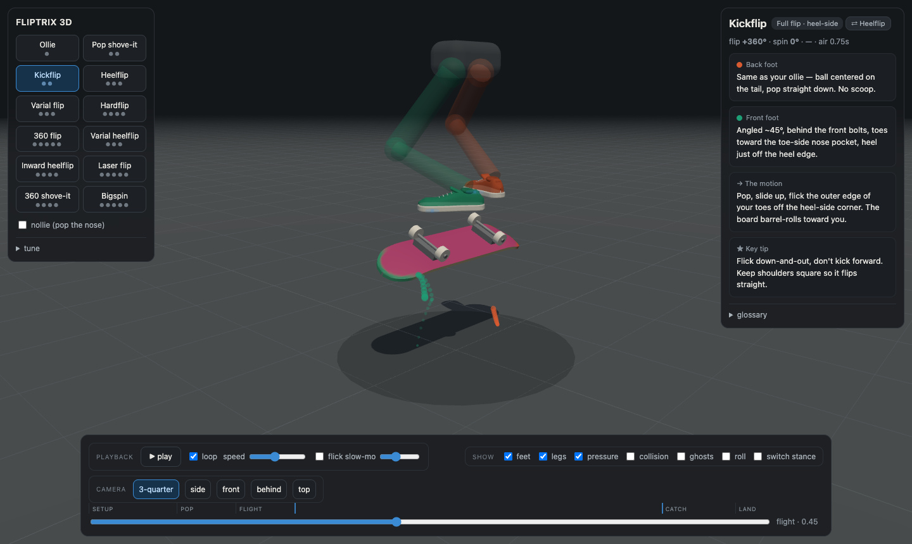
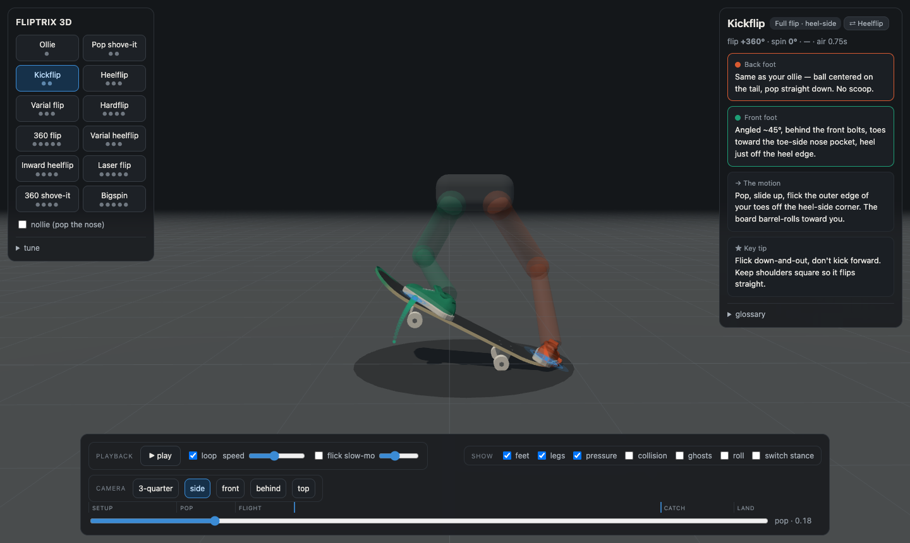
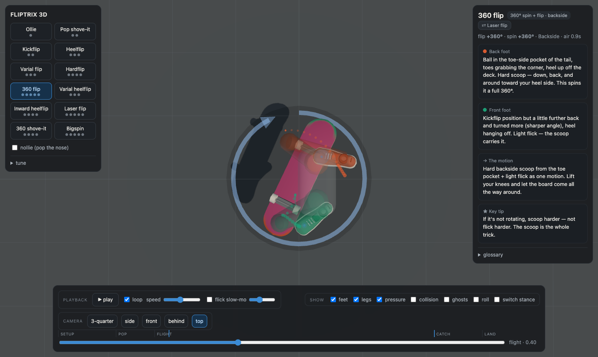
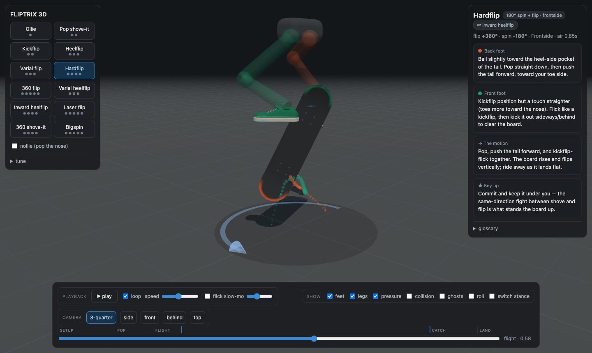
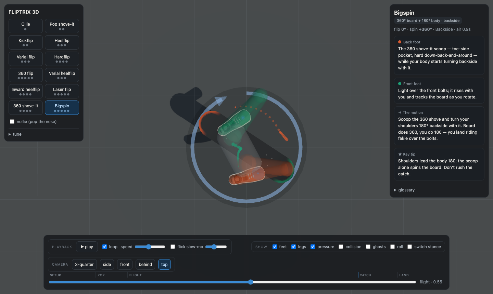

# fliptrix

interactive 3d visualizer for skateboard flip tricks — a kinematic teaching tool that shows exactly what the board, feet, and legs do through every phase of a trick.

**live: [xlyk.github.io/fliptrix](https://xlyk.github.io/fliptrix/)**

open `tricks-3d.html` in chrome or safari. single file, no build step, works from `file://` — the only network dependency is the three.js cdn.

## what it shows

- **12 tricks**: ollie, pop shove-it, kickflip, heelflip, varial flip, hardflip, 360 flip, varial heelflip, inward heelflip, laser flip, 360 shove-it, bigspin — each with a nollie variant (pop the nose instead of the tail)
- **the board**: procedural popsicle deck with steerable trucks, setup lean from foot pressure, tail snap that actually pivots off the ground, and impulse-shaped rotations (the spin loads during the scoop, the flip starts at flick contact)
- **the rider**: ghost feet in skate shoes (teal = front, coral = back), ik legs with a real loading crouch → extension → tuck → catch sequence, and pressure points that flash at the moment force is applied and leave trails showing the scoop and flick paths
- **the teaching layer**: phase-labeled timeline (setup / pop / flight / catch / land) with per-trick flick and catch markers, cue cards that light up while that foot is working and jump to their moment when clicked, mirror-trick switching, spin-direction arc, and a glossary

| | | |
|---|---|---|
|  |  |  |
| the pop: tail pivots to the ground off a deep crouch | tre: pocket-drag scoop + trails + spin arc | hardflip: board stands up between the straddling legs |

*bigspin: board does 360, the rider's hips rotate 180 with it*

## controls

- **space** play/pause (or tap the canvas) · **← →** frame-step (shift = coarse) · **1–0** select trick · **r** restart
- scrub bar with clickable phase bands; scrubbing pauses, releasing resumes
- cameras: 3-quarter / side / front / behind / top, smooth transitions, free orbit
- toggles: feet, legs, pressure, collision assist, onion-skin ghosts, forward roll, switch stance, nollie, flick slow-mo
- everything is in the url — copy/paste to share an exact setup: `?trick=tre&t=0.45&cam=top&nollie=1`

## tuning

the **tune** panel (left) exposes per-trick knobs — airtime, pop height, scoop sweep, flick kick, foot clearance, rise timing, catch moment, setup lean — plus global truck tightness. changes apply live and persist in localstorage; **copy json** exports your overrides for baking back into the `TRICKS` data.

## architecture notes

every pose (`boardPose`, `footPose`, `riderPose`) is a pure function of normalized time t, so any scrub position is deterministic and the trails/onion-skins re-derive from the same math. foot placements and scoop/flick directions are ported from `flip_trick_foot_placement_v3_portable.html`, a 2d teaching diagram audited against skate references — treat it as the source of truth. see [CLAUDE.md](CLAUDE.md) for the full invariants.
